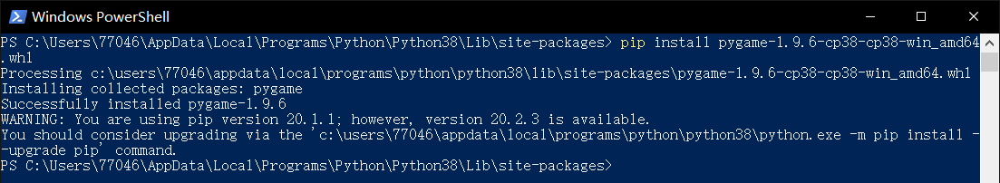

---
presentation:
  theme: solarized.css
  mouseWheel: true
  width: 1000
  height: 900
---
<!-- slide -->
## MSC@CQU 2020
## <font face="Arial Rounded MT" color=#1113d>Hello, World!</font>
record my first project 1
#### 20204254 GEAMING
<!-- slide -->
# why
the reason why I choose the project 
* <font face="楷体">首先确定要做的是project 2，
刚好可以记录我做其他的project的过程，作为一个记录来说挺有意思的
* 选择python作为代码，~~python yyds~~
* 之后选择了project1，因为给了很大的发挥空间，可以用自己的创意去弥补我技术上的不足
* 学习新代码、新模块的时候还是很有意思的
<!-- slide -->
# some difficulties😕 
|序号|描述|解决方法
| :---- | :--: | -----: |
|A|首次使用pygame模块|CSDN是眞卟錯|
|B|代码中字母的生成和随机|控制变量法+试错|
|C|md语法插入图片不好调整|换用html语言输入|
<!-- slide -->
## DIfficulty A:pygame module
---
* <font size=10>第一次使用pygame模块</font>

* Pygame常用函数（感谢CSDN&Github&Stackoverflow）😄 😄 😄
1.CSDN给出了一些常用函数的表
2.GitHub上有许多用pygame编的小游戏，可以用来看一些函数的实际应用方法
<!-- slide -->
## difficulties b:random
---
* 最主要的就是随机生成，制作出一种“雨”的感觉


<!-- slide -->
* 参考了GitHub上的“代码雨”的代码后发现
  <font size=20>**随机+循环=解决问题**
```python
while True:
    # 从队列中获取事件
    for event in pygame.event.get():
        if event.type == pygame.KEYDOWN:       #添加按键关闭功能
            exit()
        else:
            pass

    # 将暂停一段给定的毫秒数
    pygame.time.delay(50)

    # 重新编辑图像第二个参数是坐上角坐标
    winSur.blit(bg_suface, (0, 0))        #图层位置

    for i in range(len(drops)):
        text = random.choice(texts)       #字

        # 重新编辑每个坐标点的图像
        winSur.blit(text, (i * FONT_PX, drops[i] * FONT_PX))

        drops[i] += 1
        if drops[i] * 10 > PANEL_highly or random.random() > 0.95:   #高于屏幕判断
            drops[i] = 0                      #下落高度
```
<!-- slide -->
## 1.0效果图

<!-- slide -->
## 2.0代码对比

<!-- slide -->
## 2.0效果图
（不再绿黑绿黑的了）

<!-- slide -->
# final
* 字母颜色取自MSC图标下某蓝色条纹

<!-- slide -->
THANK YOU ALL
<!-- slide -->


